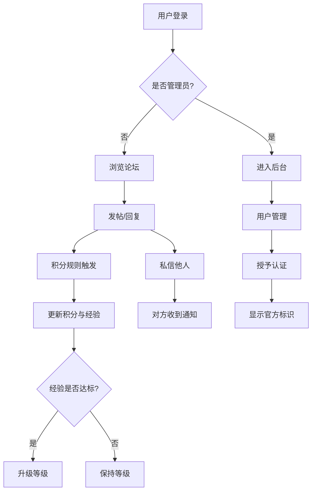

# Navo NT QQ BOT 论坛 - 产品需求文档 (PRD)

> 众合会自研论坛 · Go 语言实现 · 借鉴 bbsgo 架构思想 · ARM64 架构部署

---

## 1. 产品概述

Navo NT QQ BOT 论坛是一个面向 QQ 机器人开发者与用户的社区平台，提供话题讨论、知识沉淀、用户互动与机器人生态建设能力。
- 主要目的：为 QQ 机器人生态搭建一个简约现代、自研可控的讨论社区，支持等级积分激励、官方认证、用户私信、完整后台管理
- 目标用户：QQ 机器人开发者、运营人员、普通社区用户
- 市场价值：构建垂直于 QQ BOT 生态的高质量讨论阵地，沉淀机器人配置与玩法知识

---

## 2. 核心功能

### 2.1 用户角色

| 角色 | 注册方式 | 核心权限 |
|------|---------|---------|
| 游客 | 无需注册 | 浏览公开内容、搜索 |
| 普通用户 | 邮箱/用户名注册 | 发帖、回复、私信、积分获取、个人中心 |
| 认证用户 | 管理员授予认证 | 显示官方认证标识、置顶权限 |
| 版主 | 管理员任命 | 板块管理、帖子置顶/加精/删除 |
| 管理员 | 系统初始化 | 全站管理、用户认证、积分调整、后台全功能 |

### 2.2 功能模块

1. **首页**: Hero 区、板块导航、最新/热门帖子列表、侧边栏（在线用户、统计）
2. **板块页**: 板块描述、子板块、帖子列表（按最新/热门/精华排序）
3. **帖子详情**: 标题/正文/作者信息、回复列表、楼中楼回复、点赞收藏
4. **发帖/编辑**: Markdown 编辑器、板块选择、标签
5. **用户主页**: 个人资料、发帖记录、回复记录、等级积分展示、徽章
6. **私信**: 会话列表、消息收发、未读提醒
7. **个人中心**: 资料编辑、头像上传、安全设置、通知中心
8. **搜索**: 全文搜索帖子/用户/板块
9. **管理后台**: 仪表盘、用户管理、内容审核、板块管理、认证管理、积分管理、系统设置

### 2.3 页面详情

| 页面名称 | 模块名称 | 功能描述 |
|---------|---------|---------|
| 首页 | Hero 区 | 站点介绍、快速入口、统计数据 |
| 首页 | 板块导航 | 板块卡片网格、毛玻璃效果 |
| 首页 | 帖子列表 | 最新/热门 Tab 切换、分页 |
| 首页 | 侧边栏 | 在线用户、最新公告、签到入口 |
| 板块页 | 板块头 | 板块图标、描述、版主列表 |
| 板块页 | 帖子列表 | 排序筛选、标签筛选 |
| 帖子详情 | 帖子主体 | Markdown 渲染、附件展示 |
| 帖子详情 | 楼主信息卡 | 头像、等级、积分、认证标识 |
| 帖子详情 | 回复区 | 楼层回复、楼中楼、点赞 |
| 发帖页 | 编辑器 | Markdown 编辑、预览、标签 |
| 用户主页 | 资料卡 | 头像、签名、注册时间、等级进度 |
| 用户主页 | 内容 Tab | 主题/回复/收藏 |
| 私信页 | 会话列表 | 最近会话、未读标记 |
| 私信页 | 聊天面板 | 消息气泡、实时刷新 |
| 个人中心 | 资料设置 | 头像、昵称、签名、个人链接 |
| 个人中心 | 安全设置 | 修改密码、绑定邮箱 |
| 个人中心 | 通知中心 | 系统/回复/私信通知 |
| 搜索页 | 搜索结果 | 帖子/用户分类结果 |
| 管理后台 | 仪表盘 | 用户/帖子/访问统计图表 |
| 管理后台 | 用户管理 | 列表、搜索、禁言、认证、积分调整 |
| 管理后台 | 帖子管理 | 审核、删除、置顶、加精 |
| 管理后台 | 板块管理 | 增删改、排序、版主任命 |
| 管理后台 | 认证管理 | 认证申请、授予/撤销 |
| 管理后台 | 积分管理 | 积分规则、批量调整 |
| 管理后台 | 系统设置 | 站点信息、注册开关、上传限制 |

---

## 3. 核心流程

### 3.1 用户发帖流程

用户登录 → 选择板块 → 编写 Markdown 内容 → 提交 → 后端校验 → 写入数据库 → 积分+5/经验+10 → 推送至板块列表 → 通知关注者

### 3.2 积分等级流程

用户行为（发帖/回复/签到/被点赞）→ 积分规则匹配 → 更新用户积分与经验 → 经验阈值判定升级 → 更新等级 → 展示等级徽章

### 3.3 私信流程

用户 A 进入 B 的主页 → 点击私信 → 创建/复用会话 → 发送消息 → B 收到未读提醒 → B 打开会话 → 标记已读

### 3.4 认证流程

管理员后台 → 用户管理 → 选择用户 → 授予认证（填写认证说明）→ 用户显示官方标识 → 可撤销

### 3.5 流程图

---

## 4. 用户界面设计

### 4.1 设计风格

- **设计基调**: 简约现代，毛玻璃质感（Glassmorphism）+ 圆润边框
- **主色调**: 清新蓝紫渐变（#6366F1 → #8B5CF6）+ 柔和白/浅灰背景
- **辅色**: 成功绿 #10B981、警告橙 #F59E0B、危险红 #EF4444
- **毛玻璃**: `backdrop-filter: blur(20px)` + 半透明白底 + 1px 边框高光
- **圆角**: 卡片 20px、按钮 12px、输入框 12px、头像 50%
- **按钮**: 渐变填充主按钮、毛玻璃次按钮、悬停浮起阴影
- **字体**: 中文 PingFang SC / 思源黑体；英文 Inter（标题可选 Space Grotesk）
- **字号**: 标题 24-32px、正文 14-15px、辅助 12-13px
- **布局**: 卡片式布局、顶部导航 + 侧边栏、最大宽度 1200px 居中
- **图标**: Lucide / Heroicons 风格线性图标
- **认证标识**: 蓝色对勾徽章（官方）/ 橙色徽章（优质贡献者）
- **等级徽章**: 渐变胶囊形，含等级数字与图标

### 4.2 页面设计概览

| 页面名称 | 模块名称 | UI 元素 |
|---------|---------|---------|
| 首页 | Hero 区 | 渐变背景 + 毛玻璃标题卡 + 浮动装饰球 |
| 首页 | 板块导航 | 毛玻璃卡片网格、图标 + 名称、悬停浮起 |
| 首页 | 帖子列表 | 毛玻璃卡片、作者头像 + 认证标识 + 等级 |
| 帖子详情 | 楼主信息卡 | 圆形头像、等级胶囊、认证对勾、积分条 |
| 帖子详情 | 回复区 | 楼层卡片、楼中楼缩进、点赞动画 |
| 私信页 | 聊天面板 | 左右气泡、毛玻璃背景、未读小红点 |
| 个人中心 | 资料卡 | 大头像、等级进度环、徽章墙 |
| 管理后台 | 仪表盘 | 数据卡片、图表、侧边导航 |
| 管理后台 | 用户管理 | 表格、操作按钮、状态徽章 |

### 4.3 响应式设计

- 桌面优先（≥1200px）：三栏布局（导航 + 内容 + 侧边栏）
- 平板（768-1199px）：双栏布局，侧边栏折叠至底部
- 移动端（<768px）：单栏布局，汉堡菜单，卡片堆叠
- 触控优化：按钮最小点击区域 44px，输入框高度 ≥ 44px

### 4.4 动效

- 页面加载：内容卡片错位淡入（staggered fade-in）
- 悬停：卡片轻微上浮 + 阴影增强
- 按钮：按下缩放反馈
- 等级提升：徽章弹跳 + 粒子效果
- 私信：消息滑入动画
- 主题切换：平滑过渡

---

## 5. 等级积分体系

### 5.1 积分来源

| 行为 | 积分 | 经验 |
|------|------|------|
| 发主题帖 | +5 | +10 |
| 发回复 | +2 | +3 |
| 被点赞 | +1 | +1 |
| 签到（每日） | +3 | +2 |
| 被加精 | +20 | +30 |
| 邀请注册 | +50 | +50 |

### 5.2 等级阈值

| 等级 | 所需经验 | 徽章颜色 |
|------|---------|---------|
| Lv1 新手 | 0 | 灰色 |
| Lv2 学徒 | 100 | 绿色 |
| Lv3 行家 | 500 | 蓝色 |
| Lv4 专家 | 2000 | 紫色 |
| Lv5 大师 | 8000 | 橙色 |
| Lv6 宗师 | 30000 | 红色 |
| Lv7 传说 | 100000 | 金色 |

---

## 6. 官方认证体系

- **认证类型**: 官方认证（蓝色对勾）、优质贡献者（橙色徽章）、机器人认证（紫色齿轮）
- **认证信息**: 认证说明（如"知名 QQ BOT 开发者"）
- **展示位置**: 用户名旁、帖子楼主卡、回复楼层、私信列表
- **管理**: 仅管理员可授予/撤销，记录操作日志

---

## 7. 私信系统

- 会话模型：两用户间唯一会话，按时间倒序排列
- 消息类型：文本（支持 Markdown 子集）、表情
- 未读提醒：导航栏红点 + 数字
- 实时性：前端轮询（每 15 秒）/ 可扩展 WebSocket
- 隐私：仅会话双方可见；用户可屏蔽他人

---

## 8. 管理后台

### 8.1 模块清单

- **仪表盘**: 注册/发帖/访问趋势、实时统计
- **用户管理**: 搜索、禁言、封禁、积分调整、角色变更、认证管理
- **内容管理**: 帖子审核、违规删除、置顶、加精、移动板块
- **板块管理**: 增删改、排序、版主任命
- **认证管理**: 认证申请列表、授予/撤销
- **积分管理**: 规则配置、批量操作、日志查询
- **举报管理**: 用户举报处理
- **系统设置**: 站点信息、注册开关、上传限制、敏感词
- **操作日志**: 管理员操作审计
