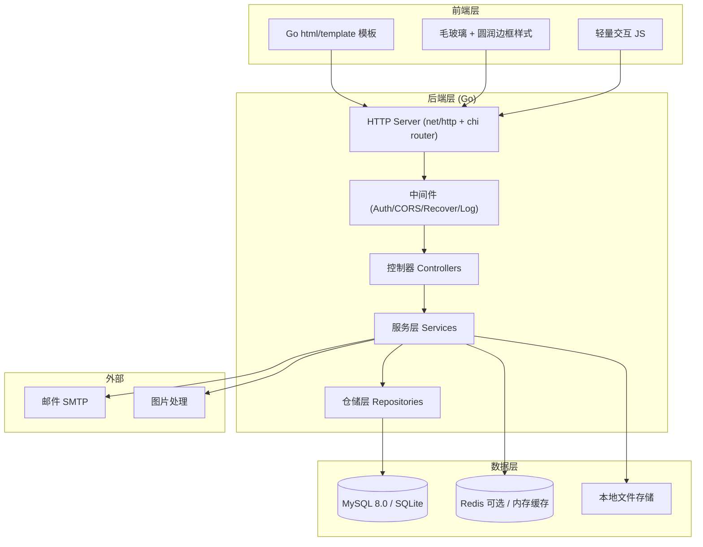
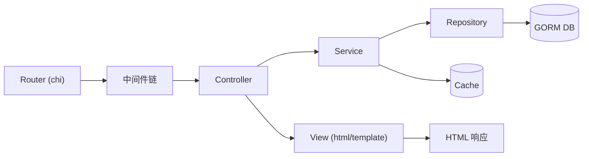
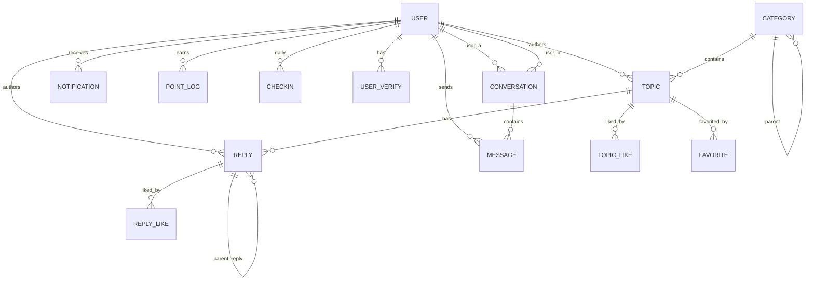

# Navo NT QQ BOT 论坛 - 技术架构文档

> Go 语言自研 · 借鉴 bbsgo 架构 · ARM64 部署 · 服务端渲染

---

## 1. 架构设计



### 1.1 分层职责

- **控制器层 (Controller)**: 解析请求、参数校验、调用 Service、组装响应
- **服务层 (Service)**: 业务逻辑编排、事务管理、跨仓储协作
- **仓储层 (Repository)**: 数据持久化、SQL 查询封装
- **模型层 (Model)**: 数据结构定义，与表一一对应
- **中间件**: JWT 会话鉴权、请求日志、Panic 恢复、CORS、限流

---

## 2. 技术选型

### 2.1 后端

| 类别 | 选型 | 说明 |
|------|------|------|
| 语言 | Go 1.22+ | 自研，标准库优先 |
| HTTP 路由 | chi (`github.com/go-chi/chi/v5`) | 轻量、兼容 net/http、中间件生态 |
| ORM | GORM v2 (`gorm.io/gorm`) | 主流、文档完善、迁移友好 |
| 数据库 | MySQL 8.0（主）/ SQLite（开发） | ARM64 原生支持 |
| 缓存 | 内存 LRU（开发）/ Redis（生产可选） | 简化外部依赖 |
| 认证 | JWT (`github.com/golang-jwt/jwt/v5`) + Cookie | 无状态会话 |
| 密码 | bcrypt (`golang.org/x/crypto/bcrypt`) | 抗暴力破解 |
| 配置 | viper (`github.com/spf13/viper`) | YAML + 环境变量 |
| 日志 | zap (`go.uber.org/zap`) | 高性能结构化日志 |
| 校验 | `github.com/go-playground/validator/v10` | 结构体标签校验 |
| Markdown | `github.com/yuin/goldmark` | GFM 兼容、安全 |
| UUID | `github.com/google/uuid` | 防枚举 ID |

### 2.2 前端

| 类别 | 选型 | 说明 |
|------|------|------|
| 模板 | Go `html/template` | 服务端渲染，自研 |
| 样式 | 手写 CSS + CSS 变量 | 毛玻璃、圆润边框、主题切换 |
| 字体 | 思源黑体 / Inter / Space Grotesk | 通过 Google Fonts CDN |
| 图标 | Lucide Icons (SVG inline) | 线性风格 |
| 交互 | 原生 JS + fetch | 无框架，轻量 |
| Markdown 预览 | goldmark 渲染 + highlight.js | 服务端渲染 |

### 2.3 部署

- **目标架构**: linux/arm64
- **构建**: `CGO_ENABLED=0 GOOS=linux GOARCH=arm64 go build`
- **运行**: 单二进制 + 配置文件 + 静态资源（embed）
- **静态资源**: 使用 Go 1.16+ `embed` 打包模板与 CSS/JS 到二进制
- **容器化**: 提供 Dockerfile（多阶段构建，arm64v8 基础镜像）

---

## 3. 路由定义

### 3.1 前台路由

| 路由 | 方法 | 用途 |
|------|------|------|
| `/` | GET | 首页 |
| `/login` | GET/POST | 登录 |
| `/register` | GET/POST | 注册 |
| `/logout` | POST | 登出 |
| `/categories` | GET | 板块列表 |
| `/c/{slug}` | GET | 板块详情 |
| `/topics` | GET | 帖子列表（支持查询参数） |
| `/t/{id}` | GET | 帖子详情 |
| `/t/new` | GET/POST | 发帖 |
| `/t/{id}/edit` | GET/POST | 编辑帖子 |
| `/t/{id}/reply` | POST | 回复帖子 |
| `/u/{username}` | GET | 用户主页 |
| `/u/{username}/topics` | GET | 用户主题 |
| `/messages` | GET | 私信会话列表 |
| `/messages/{conversationId}` | GET/POST | 私信会话 |
| `/messages/new?to={username}` | GET/POST | 发起私信 |
| `/settings` | GET/POST | 个人设置 |
| `/settings/security` | GET/POST | 安全设置 |
| `/notifications` | GET | 通知中心 |
| `/search?q=` | GET | 搜索 |
| `/checkin` | POST | 签到 |
| `/api/topics/{id}/like` | POST | 点赞帖子 |
| `/api/topics/{id}/favorite` | POST | 收藏帖子 |
| `/api/replies/{id}/like` | POST | 点赞回复 |

### 3.2 后台路由

| 路由 | 方法 | 用途 |
|------|------|------|
| `/admin` | GET | 仪表盘 |
| `/admin/users` | GET | 用户列表 |
| `/admin/users/{id}` | GET/POST | 用户编辑 |
| `/admin/users/{id}/verify` | POST | 授予/撤销认证 |
| `/admin/users/{id}/role` | POST | 修改角色 |
| `/admin/users/{id}/points` | POST | 调整积分 |
| `/admin/topics` | GET | 帖子管理 |
| `/admin/topics/{id}/moderate` | POST | 置顶/加精/删除 |
| `/admin/categories` | GET/POST | 板块管理 |
| `/admin/verifications` | GET | 认证申请 |
| `/admin/points` | GET/POST | 积分规则 |
| `/admin/logs` | GET | 操作日志 |
| `/admin/settings` | GET/POST | 系统设置 |

---

## 4. API 设计

### 4.1 认证

```go
// 请求
POST /login
{
  "username": "string",
  "password": "string"
}

// 响应（同时设置 HttpOnly Cookie）
{
  "code": 0,
  "data": {
    "token": "jwt_string",
    "user": { "id": "uuid", "username": "string", "role": "user" }
  }
}
```

### 4.2 帖子

```go
type Topic struct {
    ID          string    `json:"id"`
    Title       string    `json:"title"`
    Content     string    `json:"content"`      // Markdown
    CategoryID  string    `json:"categoryId"`
    AuthorID    string    `json:"authorId"`
    Author      UserBrief `json:"author"`
    ReplyCount  int       `json:"replyCount"`
    ViewCount   int       `json:"viewCount"`
    LikeCount   int       `json:"likeCount"`
    IsPinned    bool      `json:"isPinned"`
    IsEssence   bool      `json:"isEssence"`
    Tags        []string  `json:"tags"`
    CreatedAt   time.Time `json:"createdAt"`
    UpdatedAt   time.Time `json:"updatedAt"`
}

type UserBrief struct {
    ID           string `json:"id"`
    Username     string `json:"username"`
    Avatar       string `json:"avatar"`
    Level        int    `json:"level"`
    Verified     bool   `json:"verified"`
    VerifyType   string `json:"verifyType"` // official/contributor/bot
    VerifyLabel  string `json:"verifyLabel"`
}
```

### 4.3 私信

```go
type Conversation struct {
    ID           string    `json:"id"`
    OtherUser    UserBrief `json:"otherUser"`
    LastMessage  string    `json:"lastMessage"`
    UnreadCount  int       `json:"unreadCount"`
    UpdatedAt    time.Time `json:"updatedAt"`
}

type Message struct {
    ID             string    `json:"id"`
    ConversationID string    `json:"conversationId"`
    SenderID       string    `json:"senderId"`
    Content        string    `json:"content"`
    Read           bool      `json:"read"`
    CreatedAt      time.Time `json:"createdAt"`
}
```

### 4.4 统一响应

```go
type Response struct {
    Code    int         `json:"code"`    // 0 成功，非 0 错误码
    Message string      `json:"message"`
    Data    interface{} `json:"data,omitempty"`
}
```

---

## 5. 服务端架构图



### 5.1 关键服务

- `AuthService`: 登录注册、JWT 签发、密码校验
- `UserService`: 用户 CRUD、角色、认证、积分
- `TopicService`: 帖子 CRUD、置顶加精、浏览计数
- `ReplyService`: 回复、楼中楼
- `CategoryService`: 板块树管理
- `MessageService`: 私信会话与消息
- `PointService`: 积分规则、经验计算、等级提升
- `NotificationService`: 通知分发
- `SearchService`: 全文搜索（MySQL FULLTEXT / LIKE）
- `AdminService`: 后台统计、操作日志

---

## 6. 数据模型

### 6.1 ER 图



### 6.2 表结构 DDL（核心表）

```sql
-- 用户表
CREATE TABLE users (
  id              VARCHAR(36) PRIMARY KEY,
  username        VARCHAR(50) NOT NULL UNIQUE,
  email           VARCHAR(100) UNIQUE,
  password_hash   VARCHAR(255) NOT NULL,
  avatar          VARCHAR(500) DEFAULT '',
  signature       VARCHAR(200) DEFAULT '',
  role            VARCHAR(20) NOT NULL DEFAULT 'user', -- user/moderator/admin
  points          INT NOT NULL DEFAULT 0,
  experience      INT NOT NULL DEFAULT 0,
  level           INT NOT NULL DEFAULT 1,
  status          TINYINT NOT NULL DEFAULT 1, -- 1正常 0禁言 -1封禁
  last_login_at   DATETIME,
  last_login_ip   VARCHAR(45),
  created_at      DATETIME NOT NULL DEFAULT CURRENT_TIMESTAMP,
  updated_at      DATETIME NOT NULL DEFAULT CURRENT_TIMESTAMP ON UPDATE CURRENT_TIMESTAMP,
  INDEX idx_username (username),
  INDEX idx_role (role)
) ENGINE=InnoDB DEFAULT CHARSET=utf8mb4;

-- 用户认证表
CREATE TABLE user_verifications (
  id           VARCHAR(36) PRIMARY KEY,
  user_id      VARCHAR(36) NOT NULL,
  verify_type  VARCHAR(20) NOT NULL, -- official/contributor/bot
  label        VARCHAR(100) NOT NULL,
  granted_by   VARCHAR(36) NOT NULL,
  granted_at   DATETIME NOT NULL DEFAULT CURRENT_TIMESTAMP,
  revoked_at   DATETIME,
  UNIQUE KEY uk_user_type (user_id, verify_type),
  INDEX idx_user (user_id)
) ENGINE=InnoDB DEFAULT CHARSET=utf8mb4;

-- 板块表
CREATE TABLE categories (
  id          VARCHAR(36) PRIMARY KEY,
  parent_id   VARCHAR(36) DEFAULT NULL,
  name        VARCHAR(50) NOT NULL,
  slug        VARCHAR(80) NOT NULL UNIQUE,
  description VARCHAR(500) DEFAULT '',
  icon        VARCHAR(100) DEFAULT '',
  sort_order  INT NOT NULL DEFAULT 0,
  topic_count INT NOT NULL DEFAULT 0,
  created_at  DATETIME NOT NULL DEFAULT CURRENT_TIMESTAMP,
  INDEX idx_parent (parent_id),
  INDEX idx_sort (sort_order)
) ENGINE=InnoDB DEFAULT CHARSET=utf8mb4;

-- 帖子表
CREATE TABLE topics (
  id            VARCHAR(36) PRIMARY KEY,
  category_id   VARCHAR(36) NOT NULL,
  author_id     VARCHAR(36) NOT NULL,
  title         VARCHAR(200) NOT NULL,
  content       MEDIUMTEXT NOT NULL,
  tags          VARCHAR(255) DEFAULT '',
  reply_count   INT NOT NULL DEFAULT 0,
  view_count    INT NOT NULL DEFAULT 0,
  like_count    INT NOT NULL DEFAULT 0,
  favorite_count INT NOT NULL DEFAULT 0,
  is_pinned     TINYINT NOT NULL DEFAULT 0,
  is_essence    TINYINT NOT NULL DEFAULT 0,
  status        TINYINT NOT NULL DEFAULT 1,
  last_reply_at DATETIME,
  created_at    DATETIME NOT NULL DEFAULT CURRENT_TIMESTAMP,
  updated_at    DATETIME NOT NULL DEFAULT CURRENT_TIMESTAMP ON UPDATE CURRENT_TIMESTAMP,
  FULLTEXT KEY ft_title_content (title, content) WITH PARSER ngram,
  INDEX idx_category (category_id),
  INDEX idx_author (author_id),
  INDEX idx_pinned_created (is_pinned, created_at),
  INDEX idx_last_reply (last_reply_at)
) ENGINE=InnoDB DEFAULT CHARSET=utf8mb4;

-- 回复表
CREATE TABLE replies (
  id           VARCHAR(36) PRIMARY KEY,
  topic_id     VARCHAR(36) NOT NULL,
  parent_id    VARCHAR(36) DEFAULT NULL,
  author_id    VARCHAR(36) NOT NULL,
  content      TEXT NOT NULL,
  like_count   INT NOT NULL DEFAULT 0,
  floor        INT NOT NULL,
  status       TINYINT NOT NULL DEFAULT 1,
  created_at   DATETIME NOT NULL DEFAULT CURRENT_TIMESTAMP,
  INDEX idx_topic (topic_id, floor),
  INDEX idx_author (author_id),
  INDEX idx_parent (parent_id)
) ENGINE=InnoDB DEFAULT CHARSET=utf8mb4;

-- 点赞表（帖子）
CREATE TABLE topic_likes (
  topic_id  VARCHAR(36) NOT NULL,
  user_id   VARCHAR(36) NOT NULL,
  created_at DATETIME NOT NULL DEFAULT CURRENT_TIMESTAMP,
  PRIMARY KEY (topic_id, user_id)
) ENGINE=InnoDB DEFAULT CHARSET=utf8mb4;

-- 回复点赞
CREATE TABLE reply_likes (
  reply_id  VARCHAR(36) NOT NULL,
  user_id   VARCHAR(36) NOT NULL,
  created_at DATETIME NOT NULL DEFAULT CURRENT_TIMESTAMP,
  PRIMARY KEY (reply_id, user_id)
) ENGINE=InnoDB DEFAULT CHARSET=utf8mb4;

-- 收藏
CREATE TABLE favorites (
  user_id   VARCHAR(36) NOT NULL,
  topic_id  VARCHAR(36) NOT NULL,
  created_at DATETIME NOT NULL DEFAULT CURRENT_TIMESTAMP,
  PRIMARY KEY (user_id, topic_id)
) ENGINE=InnoDB DEFAULT CHARSET=utf8mb4;

-- 私信会话
CREATE TABLE conversations (
  id          VARCHAR(36) PRIMARY KEY,
  user_a_id   VARCHAR(36) NOT NULL,
  user_b_id   VARCHAR(36) NOT NULL,
  last_message VARCHAR(500) DEFAULT '',
  created_at  DATETIME NOT NULL DEFAULT CURRENT_TIMESTAMP,
  updated_at  DATETIME NOT NULL DEFAULT CURRENT_TIMESTAMP ON UPDATE CURRENT_TIMESTAMP,
  UNIQUE KEY uk_pair (user_a_id, user_b_id),
  INDEX idx_user_a (user_a_id),
  INDEX idx_user_b (user_b_id)
) ENGINE=InnoDB DEFAULT CHARSET=utf8mb4;

-- 私信消息
CREATE TABLE messages (
  id              VARCHAR(36) PRIMARY KEY,
  conversation_id VARCHAR(36) NOT NULL,
  sender_id       VARCHAR(36) NOT NULL,
  content         TEXT NOT NULL,
  is_read         TINYINT NOT NULL DEFAULT 0,
  created_at      DATETIME NOT NULL DEFAULT CURRENT_TIMESTAMP,
  INDEX idx_conv (conversation_id, created_at),
  INDEX idx_sender (sender_id)
) ENGINE=InnoDB DEFAULT CHARSET=utf8mb4;

-- 通知
CREATE TABLE notifications (
  id         VARCHAR(36) PRIMARY KEY,
  user_id    VARCHAR(36) NOT NULL,
  type       VARCHAR(30) NOT NULL, -- reply/like/follow/system/message
  title      VARCHAR(200) NOT NULL,
  content    VARCHAR(500) DEFAULT '',
  link       VARCHAR(500) DEFAULT '',
  is_read    TINYINT NOT NULL DEFAULT 0,
  created_at DATETIME NOT NULL DEFAULT CURRENT_TIMESTAMP,
  INDEX idx_user_read (user_id, is_read, created_at)
) ENGINE=InnoDB DEFAULT CHARSET=utf8mb4;

-- 积分日志
CREATE TABLE point_logs (
  id         BIGINT AUTO_INCREMENT PRIMARY KEY,
  user_id    VARCHAR(36) NOT NULL,
  action     VARCHAR(30) NOT NULL, -- topic/reply/like/checkin/essence/invite/admin
  delta      INT NOT NULL,
  exp_delta  INT NOT NULL DEFAULT 0,
  ref_id     VARCHAR(36),
  remark     VARCHAR(200) DEFAULT '',
  created_at DATETIME NOT NULL DEFAULT CURRENT_TIMESTAMP,
  INDEX idx_user (user_id, created_at)
) ENGINE=InnoDB DEFAULT CHARSET=utf8mb4;

-- 签到记录
CREATE TABLE checkins (
  id         BIGINT AUTO_INCREMENT PRIMARY KEY,
  user_id    VARCHAR(36) NOT NULL,
  check_date DATE NOT NULL,
  continuous INT NOT NULL DEFAULT 1,
  points     INT NOT NULL DEFAULT 0,
  created_at DATETIME NOT NULL DEFAULT CURRENT_TIMESTAMP,
  UNIQUE KEY uk_user_date (user_id, check_date)
) ENGINE=InnoDB DEFAULT CHARSET=utf8mb4;

-- 管理员操作日志
CREATE TABLE admin_logs (
  id         BIGINT AUTO_INCREMENT PRIMARY KEY,
  admin_id   VARCHAR(36) NOT NULL,
  action     VARCHAR(50) NOT NULL,
  target_type VARCHAR(30) NOT NULL,
  target_id  VARCHAR(36),
  detail     TEXT,
  ip         VARCHAR(45),
  created_at DATETIME NOT NULL DEFAULT CURRENT_TIMESTAMP,
  INDEX idx_admin (admin_id, created_at),
  INDEX idx_target (target_type, target_id)
) ENGINE=InnoDB DEFAULT CHARSET=utf8mb4;

-- 积分规则
CREATE TABLE point_rules (
  id          INT PRIMARY KEY,
  action      VARCHAR(30) NOT NULL UNIQUE,
  name        VARCHAR(50) NOT NULL,
  points      INT NOT NULL DEFAULT 0,
  experience  INT NOT NULL DEFAULT 0,
  daily_limit INT NOT NULL DEFAULT 0,
  updated_at  DATETIME NOT NULL DEFAULT CURRENT_TIMESTAMP ON UPDATE CURRENT_TIMESTAMP
) ENGINE=InnoDB DEFAULT CHARSET=utf8mb4;

-- 系统设置
CREATE TABLE settings (
  `key`   VARCHAR(50) PRIMARY KEY,
  `value` TEXT,
  updated_at DATETIME NOT NULL DEFAULT CURRENT_TIMESTAMP ON UPDATE CURRENT_TIMESTAMP
) ENGINE=InnoDB DEFAULT CHARSET=utf8mb4;
```

### 6.3 初始化数据

```sql
INSERT INTO point_rules (id, action, name, points, experience, daily_limit) VALUES
(1, 'topic',    '发主题帖', 5,  10, 20),
(2, 'reply',    '发回复',   2,  3,  50),
(3, 'liked',    '被点赞',   1,  1,  0),
(4, 'checkin',  '每日签到', 3,  2,  1),
(5, 'essence',  '被加精',   20, 30, 0),
(6, 'invite',   '邀请注册', 50, 50, 0);

INSERT INTO settings (`key`, `value`) VALUES
('site_name',        'Navo NT QQ BOT 论坛'),
('site_description', '众合会自研 QQ 机器人社区'),
('allow_register',   '1'),
('upload_limit_mb',  '5');
```

---

## 7. 项目目录结构

```
navo-nt-forum/
├── cmd/
│   └── server/
│       └── main.go              # 程序入口
├── internal/
│   ├── config/                  # 配置加载
│   ├── controller/              # 控制器（前台/后台）
│   │   ├── home.go
│   │   ├── auth.go
│   │   ├── topic.go
│   │   ├── user.go
│   │   ├── message.go
│   │   ├── admin.go
│   │   └── api.go
│   ├── service/                 # 业务服务
│   ├── repository/              # 数据仓储
│   ├── model/                   # 数据模型
│   ├── middleware/              # 中间件
│   ├── router/                  # 路由注册
│   ├── template/                # 模板渲染封装
│   └── util/                    # 工具
├── web/
│   ├── templates/               # html/template 模板
│   │   ├── layout/
│   │   ├── partial/
│   │   ├── home.tmpl
│   │   ├── topic.tmpl
│   │   ├── admin/
│   │   └── ...
│   └── static/                  # 静态资源
│       ├── css/
│       ├── js/
│       └── img/
├── migrations/                  # SQL 迁移
├── configs/
│   └── config.yaml
├── embed.go                     # embed 静态资源
├── go.mod
├── go.sum
├── Makefile
├── Dockerfile
└── README.md
```

---

## 8. 关键设计决策

### 8.1 为什么选择服务端渲染而非 SPA？

- 借鉴 bbsgo，社区类内容站 SSR 利于 SEO、首屏快、维护简单
- Go `html/template` 安全（自动转义）、原生支持、无构建步骤
- 单二进制部署，契合 ARM64 资源受限场景
- 少量交互通过 fetch + 局部刷新实现

### 8.2 ARM64 适配

- 纯 Go 实现，无 CGO 依赖（`CGO_ENABLED=0`）
- SQLite 驱动选择纯 Go 版本（`modernc.org/sqlite`）以避免 CGO
- Dockerfile 使用 `arm64v8/golang` 与 `arm64v8/alpine` 基础镜像
- 编译命令固化在 Makefile

### 8.3 安全

- 密码 bcrypt 哈希
- JWT 短期 token + HttpOnly Cookie
- CSRF token（状态变更请求）
- XSS：模板自动转义 + Markdown 渲染白名单
- SQL 注入：GORM 参数化查询
- 限流：登录/注册接口
- 管理员操作全量审计

### 8.4 性能

- 列表查询走索引 + 分页
- 热门数据内存缓存（用户等级、板块信息、积分规则）
- 浏览量异步累计
- 帖子内容缓存渲染后 HTML

---

## 9. 构建与运行

### 9.1 Makefile 目标

```makefile
build-arm64:
	CGO_ENABLED=0 GOOS=linux GOARCH=arm64 go build -ldflags="-s -w" -o bin/navo-forum ./cmd/server

run:
	go run ./cmd/server -config configs/config.yaml

migrate:
	go run ./cmd/server -migrate
```

### 9.2 Dockerfile（多阶段）

```dockerfile
FROM arm64v8/golang:1.22-alpine AS builder
WORKDIR /app
COPY . .
RUN CGO_ENABLED=0 GOOS=linux GOARCH=arm64 go build -ldflags="-s -w" -o /navo-forum ./cmd/server

FROM arm64v8/alpine:latest
RUN apk --no-cache add ca-certificates tzdata
WORKDIR /app
COPY --from=builder /navo-forum .
COPY configs/ ./configs/
EXPOSE 8080
CMD ["./navo-forum", "-config", "configs/config.yaml"]
```
